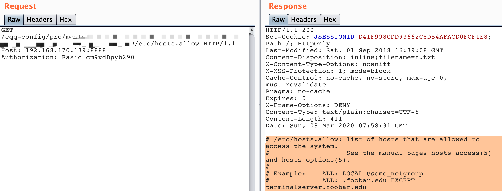
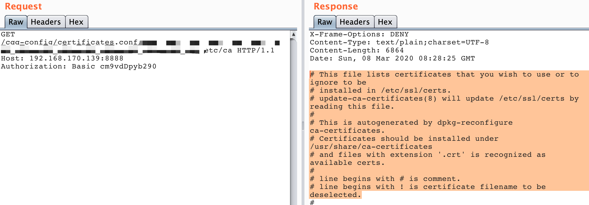

## CVE-2020-5405 spring-cloud-config路径穿越导致的信息泄露

1、/etc/hosts无法读取；/etc/hosts.allow可以读取；/etc/ca-certificates.conf还可通过拼接读取。
2、路径穿越可以被利用的条件是：
在配置文件application.properties/application.yml中配置spring.profiles.active的值为本地文件系统native（默认是git的url?）；
3、没有后缀的文件（比如/etc/passwd）无法读取，因为有一个获取文件后缀名的逻辑，即便已经读到了文件内容但是由于没有后缀名出现异常然后响应500。

